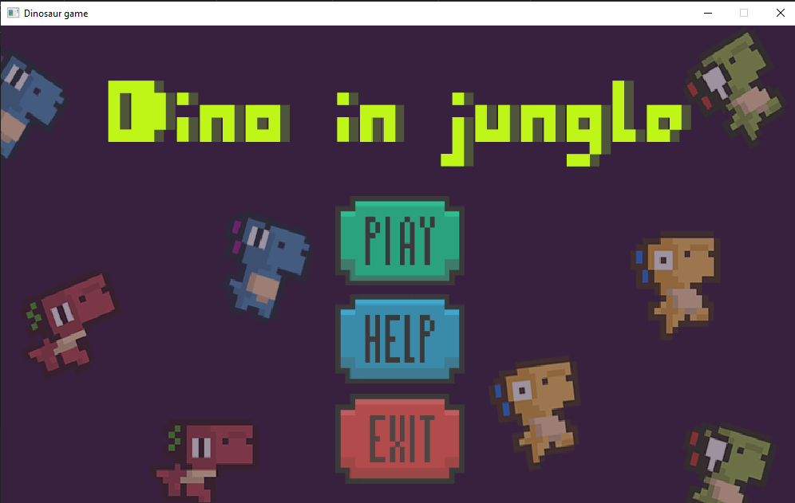

# DINOSAUR GAME

Link demo game + cấu trúc chính của game trên youtube https://youtu.be/RFlAMfVQsWw?si=PVQ6kvlo3ToExVGs

-----
## Mục Lục

### 1. Giới thiệu

### 2. Tổng quan về Game

#### 2.1 [Giới thiệu chung](#intro) 
#### 2.2 [Kiến thức áp dụng](#kiến-thức)
#### 2.3 [Đồ hoạ và âm thanh](#sound)
#### 2.4 [Cấu trúc](#cấu-trúc)
#### 2.5 [Cách cài đặt](#cài-đặt)
### 3. Nhận xét

  #### 3.1 [Ngưỡng điểm](#ngưỡng-điểm)
  #### 3.2 [Điểm tâm đắc](#lý-do)

-----

## 1. Giới thiệu 
- Họ và tên: Trần Quang Đỉnh
- Mã SV: 23020043
- Lớp học phần : 2324ll_INT2215_50
  
## 2. Tổng quan về Game
#### 2.1 Giới thiệu chung 
Dinosaur game dựa trên tựa game huyền thoại trên google chrome, được phát triển bởi Trần Quang Đỉnh. Khi chơi game, người chơi vào vai một chú khủng long có nhiều trạng thái, vượt qua những chướng ngại vật trên đường đi như xương rồng, dơi hay thậm chí là thiên thạch để chạy trốn khỏi thảm hoạ diệt vong của Trái Đất và giành về cho mình nhiều điểm nhất (**cẩn thận:** càng về sau chướng ngại vật sẽ càng nhiều)

- Cách chơi:
  
  -- Người chơi sử dụng các phím up, left và right trên bàn phím để di chuyển khủng long tương ứng với nhảy, sang trái, sang phải với mục đích vượt qua chướng ngại vật.

  | Nhảy | Trái | Phải |
  |------|------|------|
  |   ↑  |  ←   |  →   |

   -- Khi đang chơi, muốn Pause game nhấn phím escape
#### 2.2 Kiến thức áp dụng 
- Ngôn ngữ lập trình C++.
- Thư viện đồ hoạ SDL2 qua slide giảng dạy của môn học, lazyfoo.
- Kiến thức về OOP: tham khảo qua google.
#### 2.3 Đồ hoạ và âm thanh 
- Đồ hoạ: tìm kiếm các ảnh background, khủng long, các chướng ngại vật trên google và trên github [https://github.com/thai-nm/dino-in-zungle/blob/master/README.md](https://github.com/thai-nm/dino-in-zungle/tree/master)

  (Riêng phần instruction đã sửa một phần cho phù hợp với chức năng của game và tên của người phát triển) 
- Âm thanh + ttf: trên github [https://github.com/thai-nm/dino-in-zungle/tree/master](https://github.com/thai-nm/dino-in-zungle/tree/master)
#### 2.4 Cấu trúc 
- Folder sound: chứa tất cả source âm thanh của game
- Folder img: chứa tất cả source ảnh của game
- Folder ttf: chứa source văn bản
- Một số file trong game:

    - Game.h: chứa hầu hết logic của game
    - Main.cpp: chứa vòng lặp chính của game và chuyển trạng thái Menu, Play, Pause,..
    - Texturemanager.h: chứa các hàm quản lí tải và vẽ các tệp hình ảnh
    - SDLGameObject.h: Lớp đối tượng (bao gồm các kế thừa Khunglong, Bat, Monster, Heart, Meteor)
    - Loaderparams.h: chuyển thông số của các đối tượng.
    - Vector2d.h: Biểu diễn vị trí và hướng trong không gian 2d
  #### 2.5 Cách cài đặt 
  
   1. Tải file zip trên courses về máy, nên lưu vào ổ C. Tìm file.exe: C:\gamedevelopment\gamedevelopment\gamedevelopment.exe để chạy (**lưu ý:** để có dung lượng nhẹ tải lên courses, đã xoá .vs trong file zip. Do đó, file zip chỉ có chức năng demo game).
   2. Sử dụng IDE: Visual Studio 2019 để liên kết thư viện.
      
      Chi tiết về cách liên kết thư viện trên Visual Studio:https://lazyfoo.net/tutorials/SDL/01_hello_SDL/windows/msvc2019/index.php
      
  ## 3. Nhận xét
#### 3.1 Ngưỡng điểm  **: 8.5 - 9**. 
#### 3.2 Điểm tâm đắc
Dựa vào barem điểm cùng với những kiến thức đã học và làm được trong quá trình làm game, em nhận thấy điểm cho bài tập lớn 8.5 - 9 là chính xác.
-  Game tự viết: em tìm hiểu về các thư viện SDL2, OOP, quá trình làm game, logic của game, các cài đặt cần thiết cho game... từ khá sớm, có thể nhận thấy rõ điểm này trong commit đầu tiên trên repo của em đã đầy đủ logic cơ bản của game như background di chuyển, khủng long di chuyển và va chạm. Tất cả code trong game là tự tìm tòi học hỏi, tự nghĩ và tự viết. Tất nhiên đôi lúc cũng cần sử dụng chat GPT nhưng không ngoài chức năng nào khác là giải thích bug (em có vấn đề với codeblock nên việc code đôi khi gặp khó khăn với thư viện, đặc biệt khi cài ttf, thậm chí khả năng còn bị lỗi hệ thống codeblock; sau đó em phải chuyển qua VS mới có thể code tiếp)
-  Game có đồ hoạ: game có nhiều đồ hoạ.
- Game tự viết có một số phương pháp và kỹ thuật cụ thể:

   --- Các kĩ thuật
  - Thư viện SDL2.
  - Sử dụng nhiều class, vector, tách file, con trỏ, xâu chuỗi,biến, vòng lặp, cấu trúc rẽ nhánh, mảng, ...
  - Tạo nhiều đối tượng với từng class riêng: xương rồng, khủng long, bat, thiên thạch, hear,..
  - Có thể lưu lại điểm cao nhất sau các lần chơi.
  - Tạo menu và các nút ấn di chuyển giữa các phần của menu.
  - Option khi chơi: Pause game, Play game, Exit game, Restart game.
  - Photoshop edit ảnh dựa vào các nguồn ảnh có sãn phù hợp với game.
    
  --- Các phương pháp
  - Di chuyển background: trong mỗi vòng lặp, trừ đi vị trí x của tổ hợp background 1 một khoảng đồng thời tạo ra một tổ hợp background 2 liền kề sau và có cùng giá trị -x với background trước. khi tổ hợp background 1 đi hết cửa sổ game, xoá đi và tạo background 3 có các giá trị ban đầu = giá trị ban đầu của background 2. Lặp lại quá trình này. Tuy nhiên có vấn đề với thuật toán của em là sau khi tạo ra một tổ hợp background mới, game bị nháy trắng một cái rồi lại bình thường. Không tìm ra nguyên nhân gây ra nháy trắng nên em bắt buộc phải tạo ra một tổ hợp background khác gọi là middlebackground, ngay lúc bị nháy trắng thì đè middlebackground lên. (*tự nghĩ và tự viết trước khi được giảng dạy trên lớp*)
  - Check va chạm bằng hộp bao: Dùng một hình hộp bao quanh đối tượng và check va chạm dựa vào sự va chạm của các hộp bao.
  - Sử dụng kiến thức toán học tính toán dựa trên vận tốc và gia tốc tạo phản ứng nhảy của khủng long
  - Sử dụng thời gian tạo xương rồng, bat, thiên thạch với các tần suất khác nhau, điểm càng cao tần suất xuất hiện càng nhiều và càng khó.
- Nhiều và đa dạng các tính năng của một game: âm thanh, nhạc nền, texture, hoạt hình, chuyển động, ....
- Bổ sung các tính năng như tính điểm ăn trái tim tăng hp, khủng long chuyển trạng thái khi đủ điểm,... thay đổi đáng kể so với game gốc trên google chrome.

  Với các tính năng, phương pháp, logic của game và quá trình làm game như trên, em tự tin game của mình có thể đạt được mức điểm 8.5, xem xét đến mức 9 - 9.5
  

